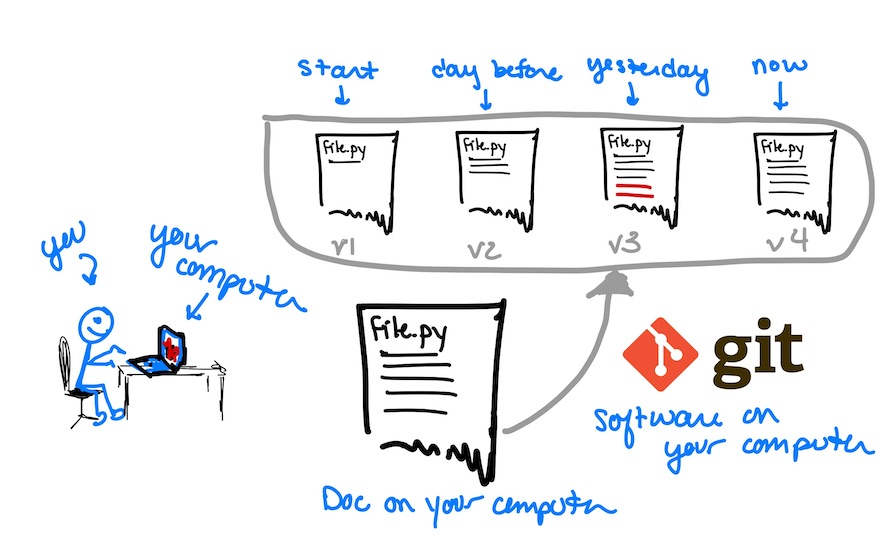
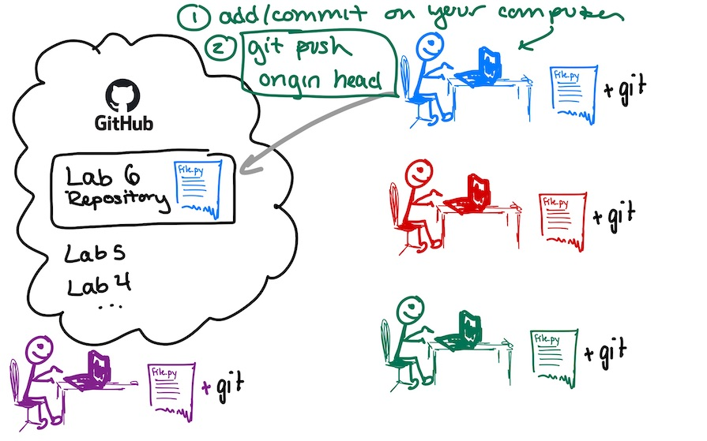
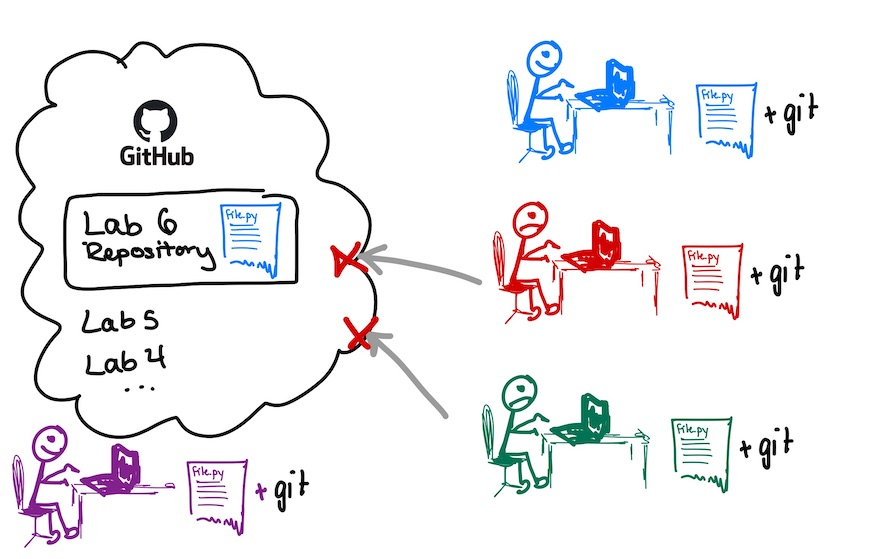
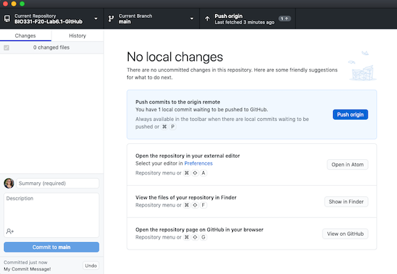

# Git and GitHub

In the first part of this lab, we will learn about Git and GitHub for managing projects.

## Git

[Git](https://git-scm.com/) is software that you will install on your computer that helps manage versions of documents.  It is an example of **version control software**.  At this point some editors have version control built in (Google Docs, for example, allows you to click backwards in the history).



Once installed, you will be able to create your own _repository_ (directory), add files, and tag versions.  You can have complete ownership over your repository, and is especially good if you have a long-term project and you may want to be able to go back to earlier versions (thesis, anyone??).  


Git is a **command line tool**, but we will access it using GitHub Desktop.  You will tag versions of a file (for example, `file.py` above) by first adding the changed file:

```
git add file.py
```

This _stages the file for a commit_, which prepares git for tagging this version.  You can add multiple files to commit a bunch at once. Then, to commit that version, you write

```
git commit -m "informational message about the changes"
```

This tags all files that have been added with a version number, and you can always revisit these versions.

## GitHub

[GitHub](https://github.com/) is a code hosting platform that uses Git as the underlying version control software.  Let's add me (Anna) and the class to this picture:


For your programming assignments and labs, I have created a _repository_ on GitHub (just like this URL).  It contains some files (this `README.md`, for example).  You can _clone_ this repo onto your own computer.  These files will be in a directory and you can open them and modify them.


Now, suppose you'd like to contribute your changes to the repository.  (We'll be doing this in the future during group projects, which will work from a single repo).  **First**, you need to add & commit your files on your computer.  These are local changes that track the version control of YOUR files. **Second**, you will _push_ these commits to the repository in GitHub.  



Alright great. But what if another student wants to contribute their changes?  They will be able to add & commit their files on their computers.  **But**, when they _push_ their commits to the repository, it will be rejected by GitHub.  



This is because other edits have been made since the student last checked the repo, and they must first _fetch_ your edits (and merge any conflicts - we'll see that a bit later).  Once they do that, then students can push their commits to the repository.  


Once the class has finished the project, I will be able to pull the changes in the repo onto my local computer. All done!  For another overview of using GitHub (including forking and branching), see this [quick tutorial](https://guides.github.com/activities/hello-world/) - we won't need this though.


## GitHub Desktop

We will use [GitHub Desktop](https://desktop.github.com/) to manage repositories.  If you are already using Git and GitHub, then keep doing what you're doing and skip to Step 3.  For the rest of us, read on...

### 1. Make a GitHub Account

Make a GitHub account [here](https://github.com/join?ref_cta=Sign+up). These accounts are free but you cannot make private repositories.  If you plan to make repositories outside of this class, I'd encourage you to apply for a [student account](https://education.github.com/discount_requests/student_application) (which gets you private repositories and a bunch of other stuff).

Send Anna your GitHub username through the chat when this is done.

### 2. Download GitHub desktop

[GitHub Desktop](https://desktop.github.com/) will install both git and a desktop application for managing GitHub repositories.  There are options for both [Macs](https://central.github.com/deployments/desktop/desktop/latest/darwin) and [Windows](https://central.github.com/deployments/desktop/desktop/latest/win32].

You will be asked to log into GitHub in order to connect the Desktop App to your account.

### 3. Clone _this_ Lab onto your machine

Click "Clone Repository" and add `Reed-CompBio/BIO331-F20-Lab6.1-GitHub` to the URL.  You will also specify the _Local Path_ - the location that this repository will be cloned on YOUR computer.  


You have cloned this repository!  The buttons on the right hand panel allow you to open the files in an editor (e.g. Atom), show the location of these files on your local machine (e.g. to open them in Spyder), or open the GitHub webpage in your browser.


### 4. Make a copy of `copy-me.txt`, commit it, and push it to GitHub

Save a copy of `copy-me.txt` with your name (e.g. `Anna.txt`).  You can modify the contents of the file.

You then need to **commit** the file. Remember that this is a Git command that saves the version on your local computer.  Checking the files in the left-hand pane is like typing `git add README.md` in a terminal.  Typing a message and hitting _commit to main_ is like typing `git commit -m "message here"`.


Once you've committed the file, you need to push those commits to GitHub. Click the _Push origin_ button to put these changes in the GitHub repository.



Great! The GitHub Repository now has your new file. Go to the GitHub website to confirm.

test
