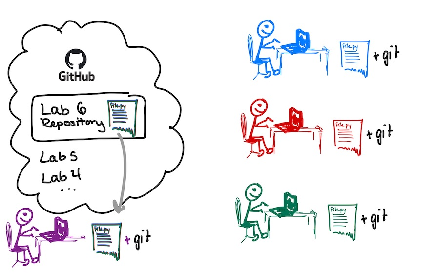

# Git and GitHub

In the first part of this lab, we will learn about Git and GitHub for managing projects.

## Git

[Git](https://git-scm.com/) is software that you will install on your computer that helps manage versions of documents.  It is an example of **version control software**.  At this point some editors have version control built in (Google Docs, for example, allows you to click backwards in the history).


Once installed, you will be able to create your own _repository_ (directory), add files, and tag versions.  You can have complete ownership over your repository, and is especially good if you have a long-term project and you may want to be able to go back to earlier versions (thesis, anyone??).  


Git is a **command line tool**, so you will need to open a Terminal (Spyder has a terminal built in) and navigate to your repository.  You will tag versions of a file (for example, `file.py` above) by first adding the changed file:

```
git add file.py
```

This _stages the file for a commit_, which prepares git for tagging this version.  You can add multiple files to commit a bunch at once. Then, to commit that version, you write

```
git commit -m "informational message about the changes"
```

This tags all files that have been added with a version number, and you can always revisit these versions.

## GitHub

[GitHub](https://github.com/) is a code hosting platform that uses Git as the underlying version control software.  Let's add me (Anna) and the class to this picture:


For your programming assignments and labs, I have created a _repository_ on GitHub (just like this URL).  It contains some files (this `README.md`, for example).  You can _clone_ this repo onto your own computer.  These files will be in a directory and you can open them and modify them.


Now, suppose you'd like to contribute your changes to the repository.  (We'll be doing this in the future during group projects, which will work from a single repo).  **First**, you need to add & commit your files on your computer.  These are local changes that track the version control of YOUR files. **Second**, you will _push_ these commits to the repository in GitHub.  





For an overview of using GitHub from the web platform, see this [quick tutorial](https://guides.github.com/activities/hello-world/).  Here, we will talk about the high-level idea and we will use [GitHub Desktop](https://desktop.github.com/) to manage repositories.  If you are already using Git and GitHub, then keep doing what you're doing!
